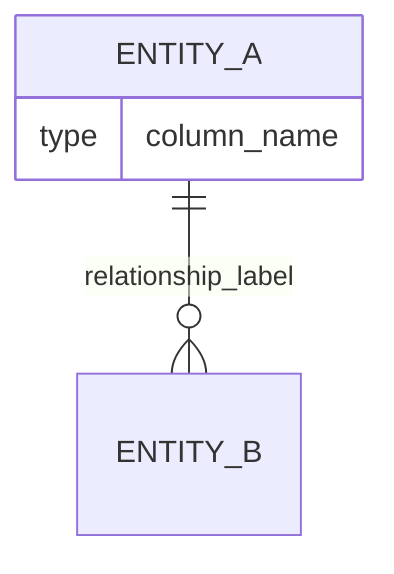

# Contract: Mermaid ER Diagram Syntax Specification

This contract defines the exact Mermaid ER diagram syntax the generators must produce.

## 1. Top-Level Structure

Every generated output starts with `erDiagram` on its own line. Entity definitions and relationships follow.



## 2. Entity (Table) Names

- Use the drizzle table name directly
- If the table belongs to a named schema, prefix with the schema name using underscore separator: `schema_tablename`
  - Example: schema `schema1`, table `table1` becomes entity `schema1_table1`
- Entity names must not contain spaces. If a drizzle table name contains spaces or special characters, replace them with underscores.

## 3. Attributes (Columns)

Each column is rendered as an attribute line inside the entity block:

```
    type column_name
```

Rules:
- `type` = the SQL type from `column.getSQLType()`, normalized (see Type Mapping below)
- `column_name` = the column's database name
- Mermaid attribute names must not contain spaces. Replace spaces with underscores.
- Mermaid types must not contain spaces or special characters. Normalize complex types (see Type Mapping).

### Attribute Constraints (Comments)

Mermaid ER supports optional constraint markers and comments on attributes. Use constraint markers for the following:

| Drizzle Constraint | Mermaid Marker |
|---------------------|----------------|
| `primaryKey()` / `.primaryKey()` | `PK` |
| `.references()` / `foreignKey()` | `FK` |
| `.unique()` | `UK` |

Multiple markers are comma-separated: `PK, FK`

Format with constraints:

```
    type column_name PK
    type column_name FK
    type column_name PK,FK
```

### Attribute Comments

Additional metadata (not-null, default, auto-increment) is rendered as a quoted comment after the constraint markers:

```
    type column_name PK "not null, increment"
    type column_name "not null, default: now()"
```

Rules for the comment string:
- Include `not null` if `column.notNull` is true
- Include `increment` if the column is auto-increment/serial
- Include `default: <value>` if `column.default` is defined. Format the default value the same way the existing `mapDefaultValue` method does.
- Items are comma-separated within the quoted string
- If no comment content exists, omit the comment entirely

## 4. Type Mapping

Mermaid ER attribute types must be single tokens (no spaces). Apply these normalizations:

| SQL Type | Mermaid Type |
|----------|-------------|
| `integer` | `integer` |
| `serial` | `serial` |
| `bigint` | `bigint` |
| `smallint` | `smallint` |
| `boolean` | `boolean` |
| `text` | `text` |
| `varchar` | `varchar` |
| `varchar(N)` | `varchar` |
| `char` | `char` |
| `numeric` | `numeric` |
| `real` | `real` |
| `double precision` | `double_precision` |
| `json` | `json` |
| `jsonb` | `jsonb` |
| `timestamp` | `timestamp` |
| `timestamp (N)` | `timestamp` |
| `timestamp with time zone` | `timestamptz` |
| `date` | `date` |
| `time` | `time` |
| `interval` | `interval` |
| `interval day` | `interval_day` |
| `interval(N)` | `interval` |
| `integer[]` | `integer_array` |
| `integer[N][]` | `integer_2d_array` |
| `blob` | `blob` |
| `binary` | `binary` |
| `varbinary(N)` | `varbinary` |
| `float` | `float` |
| `decimal` | `decimal` |
| `double` | `double` |
| `datetime` | `datetime` |
| `year` | `year` |
| `tinyint` | `tinyint` |
| `mediumint` | `mediumint` |
| `enum(...)` | `enum` |
| Any type with spaces | Replace spaces with `_` |
| Any type with parentheses | Strip parenthesized suffix (keep base type) |
| Array types `X[]` | Append `_array` to base type |
| 2D+ array types `X[N][]` | Append `_2d_array` to base type |

General normalization rule: if `column.getSQLType()` returns a string with spaces, parentheses, or brackets, normalize it to a single underscore-joined token. Strip numeric precision/length suffixes unless they are semantically important.

## 5. Relationships

### 5.1 Mermaid Relationship Notation

Mermaid ER uses this syntax:

```
    ENTITY_A <cardinality>--<cardinality> ENTITY_B : "label"
```

Cardinality symbols:

| Symbol | Meaning |
|--------|---------|
| `\|\|` | Exactly one |
| `o\|` | Zero or one |
| `}o` | Zero or more |
| `}\|` | One or more |
| `o{` | Zero or more (reverse) |
| `\|{` | One or more (reverse) |

Common relationship patterns:

| Pattern | Syntax |
|---------|--------|
| One-to-one (required both) | `A \|\|--\|\| B` |
| One-to-many | `A \|\|--o{ B` |
| Many-to-one | `A }o--\|\| B` |
| Zero-or-one to many | `A \|o--o{ B` |

### 5.2 Mapping Foreign Keys to Relationships

When `relational: false` (default) or no `relations()` are defined, derive relationships from foreign keys:

- Each foreign key produces one relationship line
- The source table (containing the FK column) is on the **many** side
- The referenced table is on the **one** side
- Use `||--o{` pattern: the referenced table has exactly-one, the source table has zero-or-more
- Label format: `"fk_name"` using the foreign key's name from drizzle

Example:
```
    users ||--o{ posts : "posts_posted_by_id_users_id_fk"
```

For composite foreign keys (multiple columns), still produce a single relationship line.

### 5.3 Mapping Drizzle Relations API to Relationships

When `relational: true` and `relations()` objects are provided:

| Drizzle Relation | Mermaid Cardinality |
|------------------|---------------------|
| `one` to `one` | `\|\|--\|\|` (exactly one to exactly one) |
| `one` to `many` | `\|\|--o{` (exactly one to zero-or-more) |

- The source table (the one defining `fields`) is placed on the left
- The referenced table is placed on the right
- Label: use the relation name from the drizzle relations config

Deduplication: when both sides of a relation define their relations (e.g., `usersRelations` defines `many(posts)` and `postsRelations` defines `one(users)`), produce only **one** relationship line. Use the same deduplication logic as the existing `generateRelations` method (sorted table name pairs with relation name as key).

## 6. Indexes

Mermaid ER diagram syntax does **not** natively support index definitions. Indexes are omitted from the Mermaid output.

However, composite primary keys discovered through `primaryKey()` in extra config should still be reflected by marking all constituent columns with `PK` in their attribute constraint markers.

## 7. Enums (PostgreSQL)

Mermaid ER does not have native enum entity support. PostgreSQL enums should be handled as follows:

- Do **not** generate a separate entity for enums
- When a column uses a PgEnum type, render the Mermaid type as `enum` (the generic token)

## 8. Output Ordering

Within the generated Mermaid output:

1. `erDiagram` header
2. All entity definitions (in schema iteration order)
3. All relationship lines (in generation order)

Separate each entity block with a blank line. Separate the entity section from the relationship section with a blank line.

## 9. Validation with mermaid-cli

All generated Mermaid output MUST be valid according to the official Mermaid parser. Use mermaid-cli to validate:

```bash
# Using bunx (recommended for this project)
bunx -p @mermaid-js/mermaid-cli mmdc -i <input.mermaid> -o /tmp/test.svg -q

# If the command succeeds (exit code 0), the Mermaid syntax is valid
# If it fails, the output contains a parse error that must be fixed
```

The validation step should be run:
- During development to catch syntax errors early
- As part of the CI/CD pipeline
- Before releasing any changes to the generator
