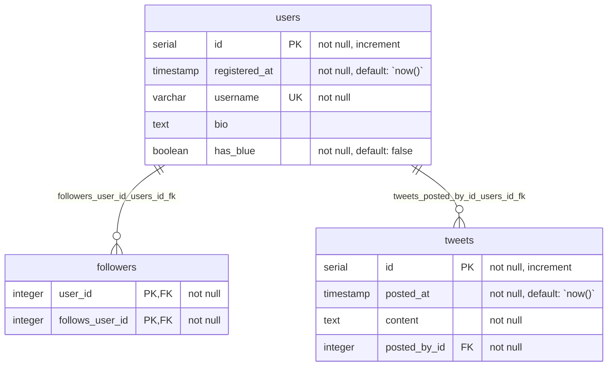

# Drizzle Mermaid Generator

Generate [Mermaid](https://mermaid.js.org/) ER diagrams from your Drizzle ORM schema. Works with PostgreSQL, MySQL, and SQLite dialects.

## Installation

```bash
# npm
npm install drizzle-mermaid-generator

# yarn
yarn add drizzle-mermaid-generator

# pnpm
pnpm add drizzle-mermaid-generator

# bun
bun add drizzle-mermaid-generator
```

Peer dependency: `drizzle-orm >= 0.45.1`

## Usage

### Programmatic API

Import the generator function for your database dialect:

```ts
import * as schema from "./schema";
import { pgGenerate } from "drizzle-mermaid-generator"; // PostgreSQL

const mermaid = pgGenerate({ schema });
console.log(mermaid);
```

#### PostgreSQL

```ts
import * as schema from "./schema";
import { pgGenerate } from "drizzle-mermaid-generator";

// Generate and output to console
const mermaid = pgGenerate({ schema });

// Generate and write to file
pgGenerate({ schema, out: "./diagrams/schema.mermaid" });

// Include relationships from Drizzle relations()
pgGenerate({ schema, out: "./schema.mermaid", relational: true });
```

#### MySQL

```ts
import * as schema from "./schema";
import { mysqlGenerate } from "drizzle-mermaid-generator";

mysqlGenerate({ schema, out: "./schema.mermaid" });
```

#### SQLite

```ts
import * as schema from "./schema";
import { sqliteGenerate } from "drizzle-mermaid-generator";

sqliteGenerate({ schema, out: "./schema.mermaid" });
```

### CLI

Use the CLI to generate diagrams without writing code:

```bash
# Using npx
npx drizzle-mermaid-generator --dialect pg --schema ./src/db/schema.ts

# Using bunx
bunx drizzle-mermaid-generator -d mysql -s ./schema.ts -o ./diagrams/schema.mermaid

# Include relationships
npx drizzle-mermaid-generator --dialect sqlite --schema ./schema.ts --relational
```

#### CLI Options

| Option                   | Description                                  |
| ------------------------ | -------------------------------------------- |
| `-d, --dialect <type>`   | Database dialect: `pg`, `mysql`, or `sqlite` |
| `-s, --schema <path>`    | Path to Drizzle schema file                  |
| `-o, --out <path>`       | Output file path (prints to stdout if unset) |
| `-r, --relational`       | Include relationship definitions             |
| `-v, --version`          | Print version                                |
| `-h, --help`             | Print help message                           |

## Output Format

The generator produces Mermaid ER diagram syntax:



### Constraint Markers

Columns display constraint markers after their type:

| Marker | Meaning               |
| ------ | --------------------- |
| `PK`   | Primary key           |
| `FK`   | Foreign key           |
| `UK`   | Unique constraint     |

Additional constraints appear in quoted comments:
- `not null` - Non-nullable column
- `increment` - Auto-incrementing
- `default: <value>` - Default value

### Relationship Notation

Relationships use Mermaid's ER diagram syntax:

```
EntityA ||--o{ EntityB : "fk_name"
```

| Symbol | Cardinality    |
| ------ | -------------- |
| `\|\|` | Exactly one    |
| `o{`   | Zero or more   |
| `\|{`  | One or more    |
| `o\|`  | Zero or one    |

## Example Schema

```ts
// schema.ts
import {
  boolean,
  integer,
  pgTable,
  primaryKey,
  serial,
  text,
  timestamp,
  varchar,
} from "drizzle-orm/pg-core";
import { relations } from "drizzle-orm";

export const users = pgTable("users", {
  id: serial("id").primaryKey(),
  registeredAt: timestamp("registered_at").notNull().defaultNow(),
  username: varchar("username", { length: 16 }).notNull().unique("uq_users_username"),
  bio: text("bio"),
  hasBlue: boolean("has_blue").notNull().default(false),
});

export const usersRelations = relations(users, ({ many }) => ({
  followers: many(followers, { relationName: "user_followers" }),
  tweets: many(tweets),
}));

export const tweets = pgTable("tweets", {
  id: serial("id").primaryKey(),
  postedAt: timestamp("posted_at").notNull().defaultNow(),
  content: text("content").notNull(),
  postedById: integer("posted_by_id")
    .notNull()
    .references(() => users.id),
});

export const tweetsRelations = relations(tweets, ({ one }) => ({
  postedBy: one(users, {
    fields: [tweets.postedById],
    references: [users.id],
  }),
}));
```

```ts
// generate.ts
import * as schema from "./schema";
import { pgGenerate } from "drizzle-mermaid-generator";

pgGenerate({ schema, out: "./schema.mermaid", relational: true });
```

## Validation

Validate generated Mermaid files with [mermaid-cli](https://github.com/mermaid-js/mermaid-cli):

```bash
# Install mermaid-cli
npm install -D @mermaid-js/mermaid-cli

# Validate a single file
mmdc -i schema.mermaid -o /dev/null

# Validate multiple files (shell loop)
for f in *.mermaid; do mmdc -i "$f" -o /dev/null || exit 1; done
```

Or use the built-in validation script (requires Bun):

```bash
bun run validate:mermaid
```

## API Reference

### `pgGenerate(options)`

| Option      | Type      | Description                                                                     |
| ----------- | --------- | ------------------------------------------------------------------------------- |
| `schema`    | `PgSchema`| Object containing PostgreSQL tables, enums, and relations                       |
| `out?`      | `string`  | Output file path. Writes to file if set, returns string otherwise              |
| `relational?`| `boolean`| Use `relations()` for relationships instead of foreign keys. Default: `false`  |

### `mysqlGenerate(options)`

| Option      | Type         | Description                                                                     |
| ----------- | ------------ | ------------------------------------------------------------------------------- |
| `schema`    | `MySqlSchema`| Object containing MySQL tables and relations                                    |
| `out?`      | `string`     | Output file path                                                                |
| `relational?`| `boolean`   | Use `relations()` for relationships. Default: `false`                           |

### `sqliteGenerate(options)`

| Option      | Type          | Description                                                                     |
| ----------- | ------------- | ------------------------------------------------------------------------------- |
| `schema`    | `SQLiteSchema`| Object containing SQLite tables and relations                                   |
| `out?`      | `string`      | Output file path                                                                |
| `relational?`| `boolean`    | Use `relations()` for relationships. Default: `false`                           |

All generate functions return the Mermaid diagram as a string.

## License

MIT
